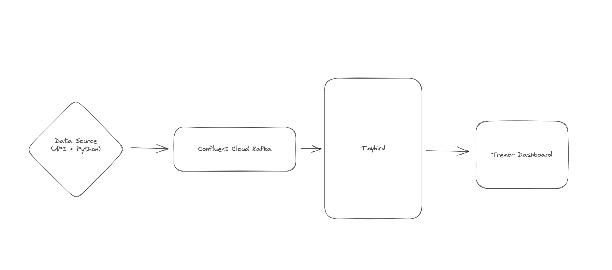

# Tinybird Live Stream: Kafka to REST APIs

This demo shows how you to turn your Kafka streams into dynamic, scalable REST APIs using [Tinybird](https://tinybird.co).

This demo contains:
- A python data generator that sends data to Kafka
- A Tinybird data project
- A Next.js + [Tremor](https://www.tremor.so/) dashboard

# Architecture

Data is generated by running the Python data generator. The python code calls the [Carbon Intensity API]() to retrieve real data. The Carbon Intensity data is not very granular, so the data generator fills in the gaps with synthetic data to increase granularity. This is purely to increase the volume of data that is going through Kafka & Tinybird to demonstrate their ability to handle data at a higher scale.

The generator is producing 2 streams of data, `intensity` and `generation` which shows the intensity of carbon emissions, and the current mix of energy generation respectively. These feed into two separate Kafka topics.

Tinybird is then connected to Kafka & consumes data from the two topics. Tinybird writes the Kafka streams into a table. There are 3 APIs and 1 Materialized View created in Tinybird to analyze & publish the data.

The Tinybird APIs are then integrated into the Next.js + Tremor dashboard to visualize the data.



# How to use

1. Create your Tinybird account & Workspace
2. Setup your Kafka
3. Setup local environment
4. Connect Tinybird to Kafka
5. Deploy Tinybird Data Project
6. Deploy Dashboard UI
7. Use the Data Generator

## Create your Tinybird account & Workspace

[Create your free Tinybird account](https://www.tinybird.co/docs/index.html#start-building-for-free) and create your first Workspace. 

## Setup your Kafka

In your Kafka, create two topics called `intensity` and `generation`. Ensure you have some credentials that grant read access to these topics.

## Setup local environment

To begin, lets setup our local environment, by cloning this repo & installing the Tinybird CLI. 

```
git clone https://github.com/tinybirdco/livestream_kafka_to_rest_apis.git
cd livestream_kafka_to_rest_apis
python3 -m venv .venv
source .venv/bin/activate
pip install -r requirements.txt
```

To finish setup, we need to authenticate the CLI. You will need to copy your Admin Auth Token from the Tinybird UI and paste it into the prompt. Run:

```
tb auth 
```

## Connect Tinybird to Kafka

You can connect Tinybird to Kafka either from the [UI](https://www.tinybird.co/docs/concepts/data-sources.html#kafka) or [CLI](https://www.tinybird.co/docs/concepts/data-sources.html#id2).

For this demo, create the connection from the CLI using the following command. You should replace the `HOST:PORT`, `KEY` and `SECRET` strings with your Kafka details.

```
tb connection create kafka --bootstrap-servers HOST:PORT --key KEY --secret SECRET --connection-name demo
```

## Deploy Tinybird Data Project

You can now deploy the Tinybird data project resources to Tinybird:

```
cd tinybird
tb push
```

## Deploy Dashboard UI

You can either run the Dashboard locally or deploy it to Vercel.

In either case, you must do this step after deploying the Tinybird Data Project (described above). Deploying the Tinybird Data Project created an Auth Token called `dashboard`. Go to the Tinybird UI and copt the value of the `dashboard` token.

### Vercel

Use the button bellow to deploy the Dashboard to Vercel. You will need to enter an Environment Variable called `VITE_APP_API_TOKEN` you should use the value of your `dashboard` token here.

[](https://vercel.com/new/clone?repository-url=https%3A%2F%2Fgithub.com%2Ftinybirdco%2Flivestream_kafka_to_rest_apis&env=VITE_APP_API_TOKEN&envDescription=A%20Tinybird%20Auth%20Token%20with%20read%20access%20to%20the%20APIs&envLink=https%3A%2F%2Fgithub.com%2Ftinybirdco%2Flivestream_kafka_to_rest_apis%23how-to-use&project-name=tinybird-kafka-to-apis&repository-name=tinybird-kafka-to-apis&root-directory=dashboard)

### Local

To run the UI locally, go to the `/dashboard` dir in your local clone of this repo. Copy the `.env.example` file and create a `.env` file (`/dashboard/.env`). Enter the value of your `dashboard` token as the value of the `VITE_APP_API_TOKEN` variable.

Then run the following:

```
npm i
npm run dev
```

The URL of the dashboard will printed to your console, open it in your browser to access the dashboard.

## Use the Data Generator

To use the Data Generator, ensure your Python virtual env is still activated as described when deploying the Tinybird data project.

Copy the `.env.example` file and create a `.env` file (`data_generator/.env`). This file has 3 variables for your Kafka details: `KAFKA_KEY`, `KAFKA_SECRET`, `KAFKA_BROKERS`. Lastly, there is a fourth variable for a Tinybird Auth Token, `TINYBIRD_TOKEN`. For the `TINYBIRD_TOKEN` you should use the value of the `data_ingest` token that is created when deploying the Tinybird data project.

To start generating data, run:

```
python generator.py
```

If you want to delete the data in Tinybird so you can run the generator again, use:

```
python reset.py
```

# Authors

- https://github.com/sdairs/ 
- https://github.com/dmytro-tinybird

# Credits

- The inspiration for this demo came from https://grid.iamkate.com/
- The data for this demo comes from https://carbonintensity.org.uk/