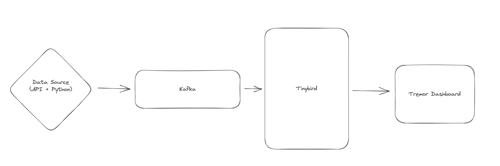

# Tinybird Live Stream: Kafka to REST APIs

This demo shows how you to turn your Kafka streams into dynamic, scalable REST APIs using [Tinybird](https://tinybird.co).

This demo contains:
- A python data generator that sends data to Kafka
- A Tinybird data project
- A Next.js + [Tremor](https://www.tremor.so/) dashboard

# Architecture

Data is generated by running the Python data generator. The python code calls the Carbon Intensity API to retrieve real data. The Carbon Intensity data is not very granular, so the data generator fills in the gaps with synthetic data to increase granularity. This is purely to increase the volume of data that is going through Kafka & Tinybird to demonstrate their ability to handle data at a higher scale.

The generator is producing 2 streams of data, `intensity` and `generation` which shows the intensity of carbon emissions, and the current mix of energy generation respectively. These feed into two separate Kafka topics.

Tinybird is then connected to Kafka & consumes data from the two topics. Tinybird writes the Kafka streams into a table. There are 3 APIs and 1 Materialized View created in Tinybird to analyze & publish the data.

The Tinybird APIs are then integrated into the Next.js + Tremor dashboard to visualize the data.

# Authors

- https://github.com/sdairs/ 
- https://github.com/dmytro-tinybird

# Credits

- The inspiration for this demo came from https://grid.iamkate.com/
- The data for this demo comes from https://carbonintensity.org.uk/